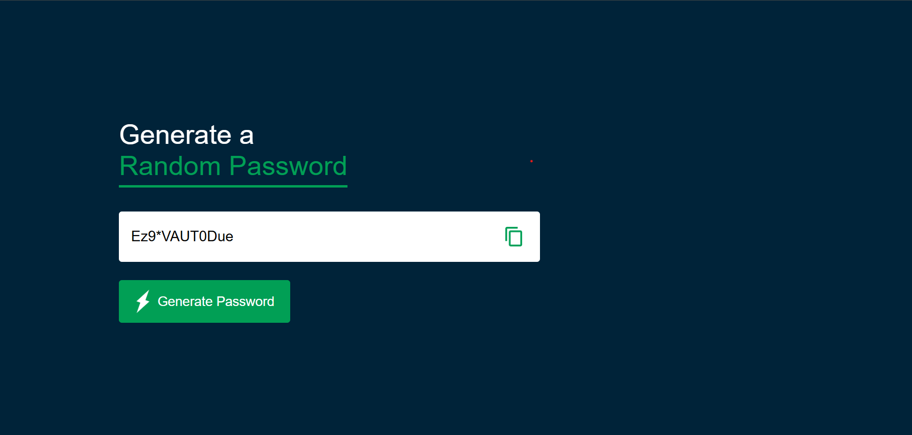

# Simple Password Generator

A lightweight web-based application that generates secure, random passwords of a fixed length (12 characters) including a mix of uppercase letters, lowercase letters, numbers, and symbols. It also features a one-click copy-to-clipboard functionality using the modern Asynchronous Clipboard API.

## Features

- 🔒 Generates 12-character strong passwords.
- 🔤 Includes a mix of all character types (A-Z, a-z, 0-9, symbols).
- 📋 One-click copy functionality with visual feedback.

