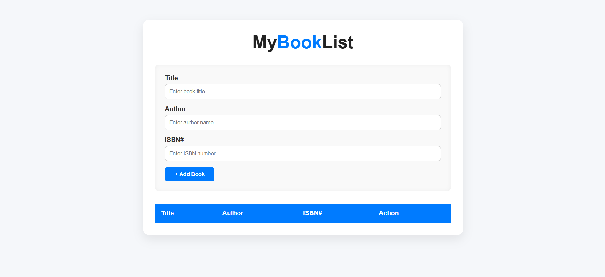

## 📚 My Book List App

A simple yet elegant web app to manage your personal book collection.
Add, view, and delete books — all stored locally in your browser using **localStorage**, so your list stays even after you close the page.

---

### ✨ Features

* 📝 **Add Books** — Save a book with its **Title**, **Author**, and **ISBN**
* 🚫 **Prevent Duplicates** — Avoid adding the same book twice
* 🗑️ **Delete Books** — Remove any book with a confirmation prompt
* 💾 **Persistent Data** — Automatically saves and loads from `localStorage`
* 🎯 **Clean UI** — Modern, minimal interface with instant feedback
* ⌨️ **User-Friendly** — Form auto-focus for smooth data entry

---

### 🖼️ Preview



---

### 🛠️ Tech Stack

| Technology           | Purpose                               |
| -------------------- | ------------------------------------- |
| **HTML5**            | Structure and layout                  |
| **CSS3**             | Styling and responsive design         |
| **JavaScript (ES6)** | App logic and localStorage management |

---

### 🚀 Getting Started

Clone the repository and open it in your browser.

```bash
# Clone this repository
git clone https://github.com/himanshu7437/book-list-app.git

# Navigate into the folder
cd book-list-app

# Open the app
# Simply open index.html in your browser
```

If you’re using VS Code, you can also run it with **Live Server** for auto-refresh.

---

### 📂 Folder Structure

```
book-list-app/
├── index.html       # Main HTML file
├── styles.css       # App styling
├── script.js        # App logic (with localStorage)
└── README.md        # Project documentation
```

---

### 💡 How It Works

1. Enter a **Title**, **Author**, and **ISBN**
2. Click **Add Book**
3. Your book appears instantly in the table
4. Data is saved automatically in your browser’s **localStorage**
5. Click ❌ to delete a book (with confirmation)

---

### 🪪 License

This project is licensed under the [MIT License](LICENSE).
You’re free to use, modify, and share it.
